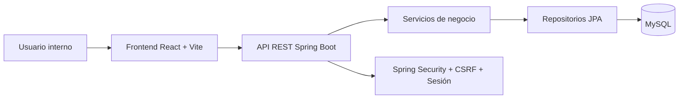
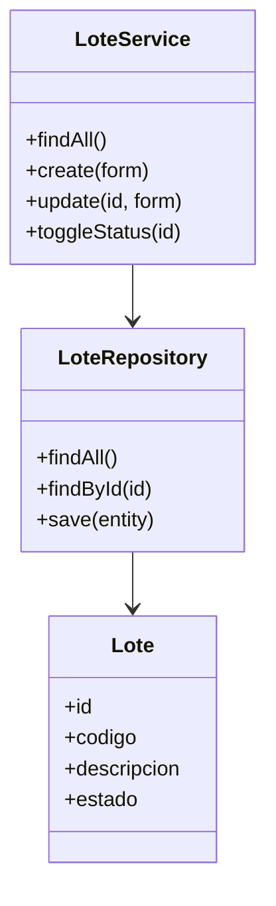
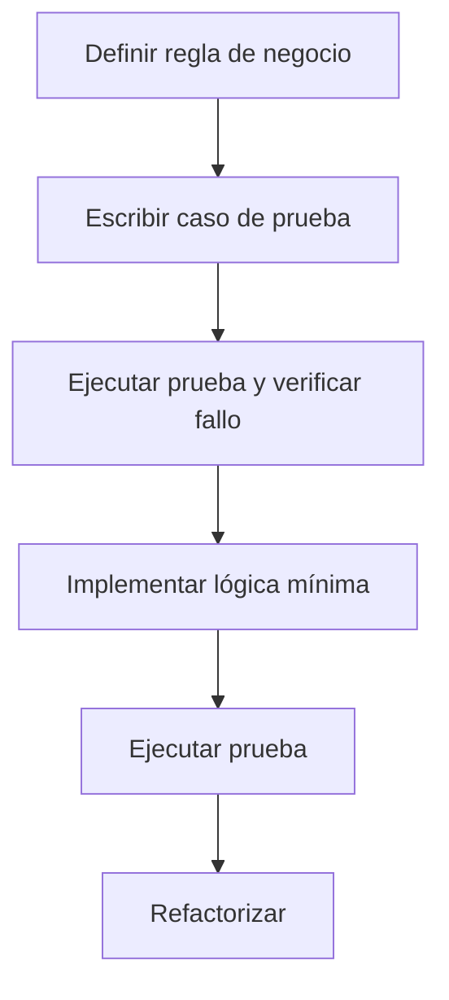
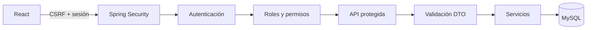

# Arquitectura, MVC/API-first, DAO, SOLID, TDD y seguridad

## 1. Arquitectura general

BlueberryTrace utiliza arquitectura web separada:

## 2. MVC aplicado como API-first

| MVC | Implementación en BlueberryTrace |
| --- | --- |
| Modelo | Entidades JPA, DTO, repositorios y servicios. |
| Vista | React + Vite + TypeScript. |
| Controlador | Controladores REST bajo `/api/v1/**`. |

Esta adaptación mantiene el principio de separación de responsabilidades, pero evita acoplar el backend a HTML. El backend responde JSON y el frontend se encarga de la experiencia visual.

## 3. DAO aplicado con Spring Data JPA

En lugar de clases DAO manuales, se utiliza Spring Data JPA como implementación moderna del patrón DAO:

## 4. Matriz SOLID

| Principio | Aplicación técnica | Ejemplo del proyecto |
| --- | --- | --- |
| S | Una clase atiende una responsabilidad principal. | `LoteService` gestiona lotes; `SiembraService` gestiona siembras. |
| O | Nuevos módulos pueden agregarse con nuevos servicios/controladores. | Agregar auditoría no exige reescribir usuarios o lotes. |
| L | Se evita herencia forzada; las entidades se relacionan por composición. | `Lote` tiene relaciones con `Cama`, `Siembra`, `Clasificacion`. |
| I | Endpoints separados por recurso. | Un módulo consume solo `/siembras` si registra siembras. |
| D | Inyección de dependencias con Spring. | Servicios reciben repositorios por constructor. |

## 5. Estrategia TDD inicial

Casos prioritarios:

1. Autenticación correcta e incorrecta.
2. Registro de lote con código único.
3. Registro de siembra con lote/cama válidos.
4. Validación de cantidad mayor a cero.
5. Clasificación y despacho con datos completos.
6. Acceso denegado a rutas protegidas.

## 6. Seguridad desde el diseño

| Amenaza | Mecanismo |
| --- | --- |
| Acceso no autorizado | Spring Security y sesión autenticada. |
| CSRF | Token CSRF consumido por React. |
| Contraseñas expuestas | BCrypt. |
| Datos inválidos | Bean Validation + validaciones frontend. |
| Consultas inseguras | Repositorios JPA y consultas parametrizadas. |
| UI legacy expuesta | Backend API-first sin `templates` ni `static`. |
